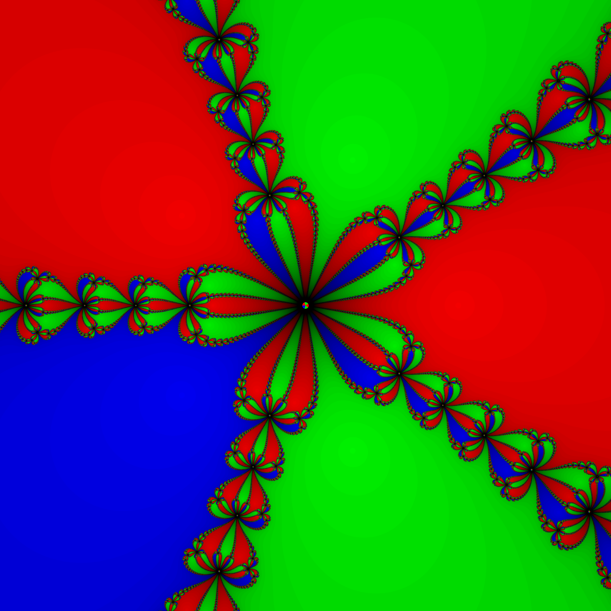

# Newton Fractal Renderer

This project renders **Newton fractals** for the equation:

```
z^n - 1 = 0
```

It uses:
- **C++** for orchestration and image output
- **[ISPC](https://ispc.github.io/)** for SIMD-accelerated fractal computation

The program produces a visual representation of the Newton-Raphson method over the complex plane, where each pixel is colored based on which root the iteration converges to.

## Project Structure

```
.
├── include
│   ├── image_writer.hpp
│   ├── renderer.hpp
│   └── types.hpp
├── LICENSE
├── main.cpp
├── Makefile
├── README.md
└── src
    ├── image_writer.cpp
    ├── newton.ispc
    └── renderer.cpp
```

---

## Requirements

- C++17 compiler (e.g., `g++`, `clang++`)
- [ISPC Compiler](https://ispc.github.io/)
- GNU Make


## Build Instructions

From the root directory:

```bash
make
```

Then run the program with:

```bash
./newton_fractal -n 5

./newton_fractal -n 4 -width 4000 -height 4000 -iter 100

./newton_fractal -n 3 -width 5000 -height 5000 -iter 200

./newton_fractal -h
```

## Clean

To clean up build files:

```bash
make clean
```

